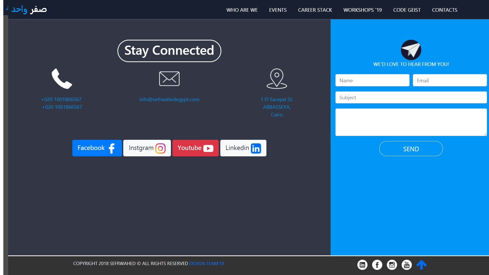

# Sefrwahed

This is Sefrwahed last updated website (www.sefrwahedegypt.com).
I contributed in the main page in updating 3 Sections: Who are we, Events, and Contact us section, added the pop-up ( It will be added to the website soon working just working on adding a feature to the popup before puplishing it). I also worked from scratch on the Code Geist page (www.sefrwahedegypt.com/code-geist).

## Who are we:
Before:

After:

## Events:
Meged its design from code geist page. i also generated the cards with javascript and added to them dynamic date for the count down.
Before:

After:

## Connect:
Before:

After:

### pop up:

## Code Geist page:
With the help of Sefrwahed design team and considering our theme for Code Geist, I designed the page and and fully equiped it and it will be updated with new features and fixes.
You can see the page through here : www.sefrwahedegypt.com/code-geist

### Note:
- The part of website inculded here is the only parts and pages i worked on, I didnt include the pages which i didnt contributed in.
- To smoothly navigate through the pages you can open  the command terminal and write:
* If you have Python 2, run python -m SimpleHTTPServer 8000. 
* If you have Python 3, run python -m http.server 8000.
then navigate your browser to http://localhost:8000/. 
